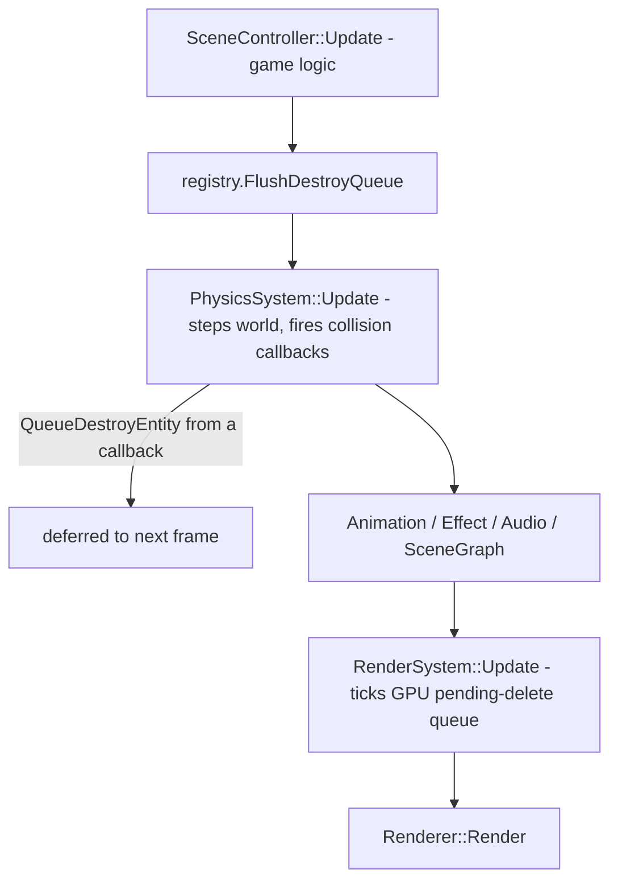

## Overview

Three PRs, landed in order. Each leaves the game working. PR1 and PR2 both touch [PhysicsSystem.cpp](src/core/ecs/systems/PhysicsSystem.cpp), so sequencing them avoids conflicts; PR3 depends on both.

Design background for PR3 is in [docs/Wave System Design.md](docs/Wave%20System%20Design.md), which PR3 updates (`WaveLibrary` becomes `WaveStore`).

---

## PR 1: PhysicsSystem processes only active bodies

**Branch:** `cursor/physics-active-only-de8a`

Today `PhysicsComponent::enabled` only skips transform sync. The body stays in the Box2D broadphase, still collides, and still generates sensor events.

### Changes

**[src/core/physics/PhysicsEngine.h](src/core/physics/PhysicsEngine.h) / [.cpp](src/core/physics/PhysicsEngine.cpp)**
- Add `void SetBodyEnabled( PhysicsBody& body, bool enabled )` wrapping `b2Body_Enable` / `b2Body_Disable`.
- Remove the unconditional `b2World_Draw( mWorldId, &mDebugDraw )` from `Update`, or gate it behind `SetDebugDrawEnabled( bool )` defaulting to off. Every `mDebugDraw` callback body is commented out, so this is a full world shape walk per frame for zero output.

**[src/core/ecs/components/Physics.h](src/core/ecs/components/Physics.h)**
- Rename field `enabled` to `active`, `EventType::SetSleep` to `SetActive`, and `QueueSleep( bool is_sleep )` to `QueueSetActive( bool active )`.
- The polarity inverts, so translate each of the 7 call sites explicitly and review them carefully:
  - [AsteroidGameplaySystem.cpp](src/game/systems/AsteroidGameplaySystem.cpp) lines 99, 214: `QueueSleep( true )` becomes `QueueSetActive( false )`; line 186: `QueueSleep( false )` becomes `QueueSetActive( true )`.
  - [BulletSystem.cpp](src/game/systems/BulletSystem.cpp) lines 102, 263, 289: `QueueSleep( true )` becomes `QueueSetActive( false )`; line 178: `QueueSleep( false )` becomes `QueueSetActive( true )`.

**[src/core/ecs/systems/PhysicsSystem.cpp](src/core/ecs/systems/PhysicsSystem.cpp)**
- `SetActive` event handler calls `SetBodyEnabled`, and zeroes linear and angular velocity when deactivating (preserving current behaviour).
- Early-out in the `Update` loop, placed after the lazy body creation:

```cpp
if( !physics.active && physics.pending_events.empty() )
{
	continue;
}
```

Callers must `QueueSetActive( true )` before velocity/force events; the queue is processed in order.

### Verify before merging

Disabled Box2D bodies have no `BodyState`, so `b2Body_SetLinearVelocity` silently no-ops. Callers must `QueueSetActive( true )` before velocity/force events; PhysicsSystem processes the queue in order and does not reorder. `SetPosition` still works while disabled (BodySim).

Manual check: despawned asteroids no longer damage the player, and respawn still places them correctly at the play-field edge.

---

## PR 2: Entity, component, and physics body release

**Branch:** `cursor/entity-release-de8a`

`ECSRegistry` has no `DestroyEntity`, and nothing ever calls `RemoveReference` on `PhysicsSystem::mBodyManager`. There is also no teardown path for scene re-entry: [MainScene::OnEnter](src/game/MainScene.cpp) creates the player, background, screen zone, and 100 asteroids, and `OnExit` destroys none of them.

**Decision taken:** entity IDs are monotonic and never recycled. Only components and external resources are freed. `ComponentPool::mSparse` grows with the high-water mark, which stays low as long as enemies stay pooled.

### Changes

**[src/core/ecs/ECS.h](src/core/ecs/ECS.h)**
- `AbstractComponentPool` gains `virtual void Remove( Entity entity ) = 0;` and `virtual bool Has( Entity entity ) const = 0;`. `TypedComponentPool<T>` forwards both to `pool`. This gives generic teardown without any per-entity type bookkeeping.
- `ECSRegistry` gains an `Observer` interface mirroring `PhysicsSystem::Observer`, so the registry stays free of graphics and physics dependencies:

```cpp
class Observer
{
public:
	virtual ~Observer() = default;
	virtual void OnEntityDestroying( Entity entity ) = 0;
};

void Subscribe( Observer* observer );
void Unsubscribe( Observer* observer );
```

- New API: `DestroyEntity( Entity )` (immediate), `QueueDestroyEntity( Entity )` (deferred), `FlushDestroyQueue()`.
- `DestroyEntity` notifies observers first, then walks `mComponents` calling `Remove( entity )` on every pool.

**Deferred destruction is mandatory, not optional.** `PhysicsEngine::ProcessContactEvents` iterates a batch of events holding `PhysicsBody*` recovered from shape user data. Destroying a body from inside a collision callback invalidates later entries in that same batch.



**[src/VortexGame.cpp](src/VortexGame.cpp)**
- Call `mECSRegistry->FlushDestroyQueue()` in `Run`, between `mSceneController->Update( dt )` and `mPhysicsSystem->Update( dt )`. One flush point only.

**[src/core/ecs/systems/PhysicsSystem.cpp](src/core/ecs/systems/PhysicsSystem.cpp)**
- Subscribe as an `ECSRegistry::Observer`. In `OnEntityDestroying`, if the entity has a `PhysicsComponent` with a valid `body_id`, call `mBodyManager.RemoveReference( body_id )`, which destroys the `PhysicsBody` and runs `b2DestroyBody`.

**[src/core/ecs/systems/RenderSystem.cpp](src/core/ecs/systems/RenderSystem.cpp)**
- Subscribe as an `ECSRegistry::Observer`; add a public `DetachRenderable( Entity )` for explicit use.
- `AttachRenderable` allocates a per-entity uniform buffer and descriptor set. **These cannot be freed the same frame** - up to `Renderer::MAX_FRAMES_IN_FLIGHT` frames may still reference them. Add a small pending-delete list of `{ ResourceId, frames_remaining }` ticked down in `RenderSystem::Update`, freeing at zero. Do not use `WaitForIdle`; it stalls mid-gameplay.
- `mesh_buffer_id` and `material_id` are shared between entities (all 100 asteroids share one mesh via `AttachRenderable`), but `AttachSprite` creates a mesh per entity. Fix the refcounting properly: `AttachRenderable` calls `AddReference` on the mesh and material, teardown calls `RemoveReference`. Naive unconditional freeing would destroy a mesh still used by other pooled entities.

**Scene graph pruning**
- On destroy, remove the entity from its parent's `SceneGraphComponent::children_entities` (the parent is reachable via `parent_entity`), and destroy its own children recursively. Collect the full set first, then destroy, to avoid mutating while walking. Without this, [SceneGraphSystem::UpdateChildrenRecursive](src/core/ecs/systems/SceneGraphSystem.cpp) walks dangling ids forever.

**Pooled systems**
- Add an explicit `ReleaseAll()` to `BulletSystem`, `AsteroidGameplaySystem`, and `EffectSystem` that destroys pooled entities and clears `mPools` / `mEntityToPool` / `mAllAsteroids` / `available` / `all`. Do not rely on the registry observer to clean these up; the id containers are system-private.
- Call them from `MainScene::OnExit` so scene re-entry no longer duplicates everything.

---

## PR 3: Wave mechanic

**Branch:** `cursor/wave-system-de8a`

Follows [docs/Wave System Design.md](docs/Wave%20System%20Design.md) with `WaveLibrary` renamed to `WaveStore` throughout (update the doc in this PR too). Enemies stay pooled; PR2's release path is used for scene teardown and pool rebuilds, not per-kill.

### New files

- `src/game/waves/WaveTypes.h` - `SpawnPattern`, `EnemyArchetype`, `SpawnGroup`, `WaveDefinition`
- `src/game/waves/WaveStore.h` / `.cpp` - parse, validate, `ComputePoolRequirements()`
- `src/game/systems/EnemySystem.h` / `.cpp` - generalised from `AsteroidGameplaySystem`
- `src/game/systems/WaveSystem.h` / `.cpp`
- `src/game/components/ContactDamageComponent.h`
- `resources/waves/index.json`, `resources/waves/wave_01.json`, ...

Add every new `.cpp` to the root [CMakeLists.txt](CMakeLists.txt), which lists game sources explicitly. Note `src/game/GameMaterials.cpp` is tracked but absent from that list.

### Commit sequence within the PR

1. **Un-ignore wave data.** [.gitignore](.gitignore) ignores `resources` wholesale, so balance data would be untracked. Re-include `resources/waves/` (git will not descend into an ignored directory, so the parent needs re-including too).
2. **`EnemySystem` generalisation** - rename `AsteroidGameplaySystem`, replace the single hardcoded pool with archetype-keyed pools and a `PreparePool( render_system, archetype, count, root ) -> EnemyPoolId` / `Spawn( pool_id, position, velocity )` API mirroring [BulletSystem](src/game/systems/BulletSystem.h). Keep one hardcoded archetype so this commit is a pure refactor with no behaviour change. Switch the update loop from walking `mAllAsteroids` (an `unordered_set` with a hash lookup per entity) to a dense walk of `GetComponentMap<HealthComponent>()`.
3. **`WaveStore`** - typed structs plus a validation pass reporting `file:wave:group:field`. This matters more than any other single piece: `get_json_int` in [JsonParser.h](src/core/utility/JsonParser.h) returns `0` for a missing key, a typo, and a genuine zero alike. Validate that every `archetype_id` resolves and that every archetype asset path is present in the scene manifest (`GetTexture` returns `0` for unknown paths, and `0` is a valid bindless index, so a missing asset silently renders the wrong sprite).
4. **`WaveSystem`** - `IDLE` / `RUNNING` / `INTERMISSION` / `FINISHED`, spawn-group timers, and completion when live count hits zero or `duration_sec` expires. Survivors are despawned on timeout, keeping worst-case pool accounting valid. Owns its own `std::mt19937` seeded from the index file rather than sharing the unseeded global `rand()` stream.
5. **Wiring** - `MainScene::OnEnter` loads the store, sizes pools from `ComputePoolRequirements()`, and preps every archetype up front (pool warm-up does immediate GPU work and must never happen mid-wave). Tick `mWaveSystem->Update( dt )` *after* `mEnemySystem->Update()` so this frame's deaths are reflected in the count it reads.
6. **HUD** - `wave_number`, `wave_time_remaining`, `enemies_remaining` through [StatusPanel](src/game/ui/StatusPanel.cpp) and `hud.rml`, using the existing `UIDataModel::Declare` / `Set` pattern.
7. **Archetype-driven contact damage** - replace the hardcoded `50.f` in `OnCollideBegin` with `ContactDamageComponent` populated at pool preparation.

### Optional split

If commit 2 makes the review too large, land it as its own PR (`cursor/enemy-system-archetypes-de8a`) between PR2 and PR3. It is a behaviour-preserving refactor and reviews cleanly in isolation.

---

## Notes

- Hot-reload is deliberately out of scope for PR3. Scope it to load-at-scene-enter, which delivers most of the iteration benefit; in-session reload needs wave-boundary gating and archetype/pool validation.
- `src/core/` must stay free of game-specific code, so `WaveStore`, `EnemySystem`, and `WaveSystem` all live under `src/game/`.
- Follow the project standard in all three PRs: Allman braces, hard tabs, spaces inside parens, `#ifndef` guards (never `#pragma once`), ASCII-only sources, and out-of-line definitions with the return type on its own line.
